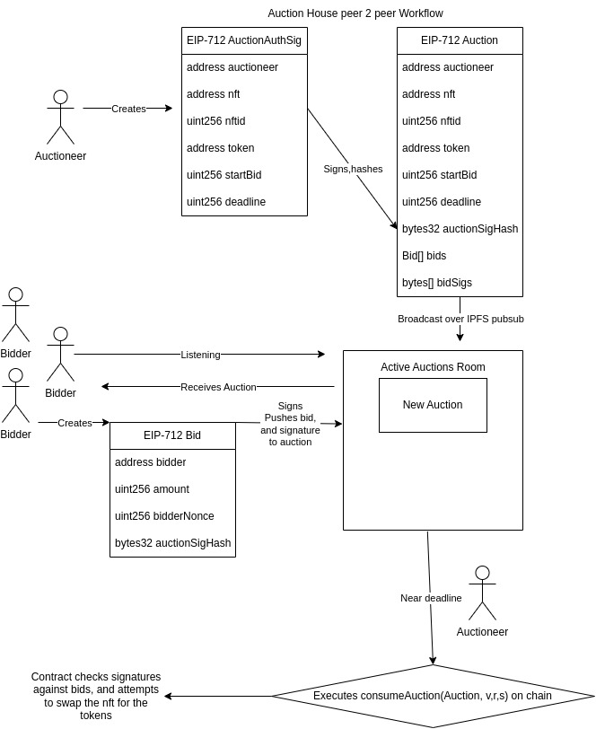

# Auction House Peer 2 Peer
Exploring the decentralized auctioning of Evm based assets over Ipfs pubsub with nested EIP-712 permits

## [EIP-712](https://eips.ethereum.org/EIPS/eip-712) Chains
If one is familiar with signing a permit message before an erc20, they are familiar with the usage. This project explores placing ones permit messages inside others' permit messages and, naturally, so on and so forth into some pre-determined onchain consumable.

## Ipfs libp2p webrtc
Beyond an initial ping to a signalling server, agents can communicate many to many in network time with libp2p-webrtc and ipfs pubsub. Agents can express 'forward commitments' by chaining EIP-712 together with other agents in real time prior to some end date.  This permit chain is than consumed by a transaction on the network and simply attempts to execute the prescribed logic.

## Usage- localnet
`cp .env.example .env`
Add the mnemonic from a metamask instance, and the IPv4 address of your local network (on ubuntu `ifconfig` and look for an inet often with 192.168.x.x)
`docker compose up`
### Down
`docker compose down`
### Rebuild
`docker compose build`
### Description
Docker bootstraps an instance of ganache-cli, runs the `/hardhat/scripts/deploy.js`, bootstraps a webrtc star for the initial ipfs connection and runs the front end on 5173 and 5174 to display the peer 2 peer connection without sharing localstorage

## Usage- docs
`cd docs && npm install`
`npx docusaurus start`

## Usage- hardhat
`cd hardhat && npm install`
`npx hardhat test ./test/EnglishAuction.js`

