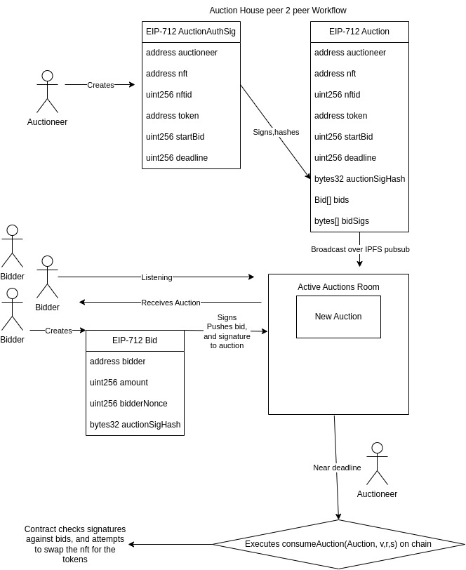

# Introduction

Auction House Peer to Peer (AH p2p) enables the decentralized auctioning of ethereum based assets over IPFS pubsub through the use of a technique called permit chaining. An Auctioneer signs a message with the auction details, broadcasts it to the network, to which bidders than sign another message with their bid details and appends it to the auctioneers original message.  At some point the Auctioneer than submits this blob of permits to the Smart Contract, which verifies the signatures in coincidince with the data, and executes the swap with the highest bidder.


## Getting Started


### What you'll need

- [Node.js](https://nodejs.org/en/download/) version 16.14 or above:
  - When installing Node.js, you are recommended to check all checkboxes related to dependencies.

## Generate a new site

Generate a new Docusaurus site using the **classic template**.

The classic template will automatically be added to your project after you run the command:

```bash
npm init docusaurus@latest my-website classic
```

You can type this command into Command Prompt, Powershell, Terminal, or any other integrated terminal of your code editor.

The command also installs all necessary dependencies you need to run Docusaurus.

## Start your site

Run the development server:

```bash
cd my-website
npm run start
```

The `cd` command changes the directory you're working with. In order to work with your newly created Docusaurus site, you'll need to navigate the terminal there.

The `npm run start` command builds your website locally and serves it through a development server, ready for you to view at http://localhost:3000/.

Open `docs/intro.md` (this page) and edit some lines: the site **reloads automatically** and displays your changes.
